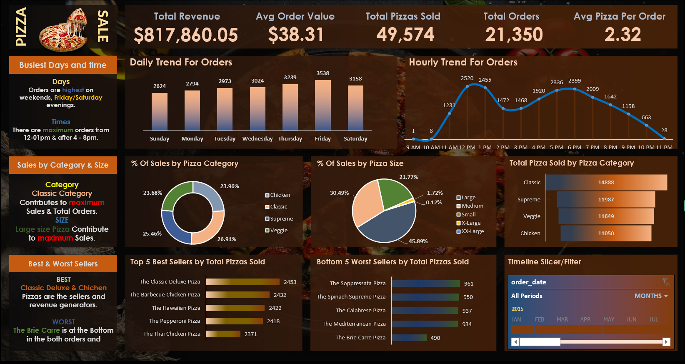
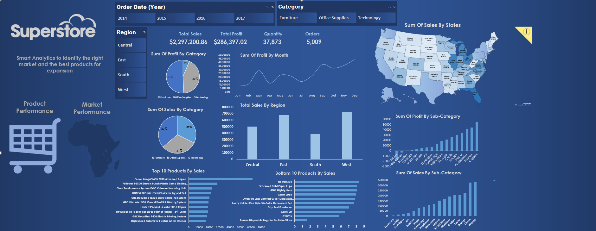

<table>
  <tr>
    <td style="vertical-align: top;">
    <h1 style="color: #2E86C1; font-size: 2.5em; margin-bottom: 20px;">
     
         Zeyad Mohammed Abdullah
    </h1>

  <h3>📊 Data Analyst From Egypt </h3>
  A passionate <strong style="color: #E74C3C;">Data Analyst</strong> with strong skills in 
  <a href="">Python</a>, 
  Power BI, 
  Excel, and 
  SQL. 
  I enjoy turning raw data into actionable insights and building dashboards that help businesses make better decisions.

   <div">
     🔍 Data Explorer • 📈 Repo Rankings • 📊 Developer Analytics • 🗂️ Repo Analytics • 📁 Collections • 
 

    </td>
    <td width="200" style="vertical-align: top;">
      
    </td>
  </tr>
</table>
<!-- ---><!-- ---><!-- ---><!-- ---><!-- ---><!-- ---><!-- ---><!-- ---><!-- ---><!-- ---><!-- ---><!-- ---><!-- ---><!-- ---><!-- ---><!-- --->
<!--  ---><!-- ---><!-- ---><!-- ---><!-- ---><!-- ---><!-- ---><!-- ---><!-- ---><!-- ---><!-- ---><!-- ---><!-- ---><!-- ---><!-- ---><!-- --->

<table>
  <tr>
    <td style="vertical-align: top; padding-right: 20px;">
      
- 🔭 I have recently finished my project.
     <a href="https://github.com/zeyadmohammedabdullahhassan-rgb/Data-Analysis-Pizza-Sales-Project">PIZZA SALES</a>
      
- 🌱 I’m currently learning  { Data Analyst | Data Engineering }
  
- 👨‍💻 All of my projects are available at
<a href="https://github.com/zeyadmohammedabdullahhassan-rgb">PROJECTS</a>

- 💬 Phone: **+201055474248**
  
- 📫 How to reach me <a href="https://mail.google.com/mail/u/2/#inbox">Gmails</a>

<h3 align="left">Connect with me:</h3>

<h3 align="left">Languages and Tools:</h3>

 
 
 
 
    
   
   
   

    </td>
    <td width="400" style="vertical-align: top;">
      
    </td>
  </tr>
</table>

<!-- First Project pizza sales ---->

<table>
  <tr>
        <td style="vertical-align: top;">
      

     <a href="https://github.com/zeyadmohammedabdullahhassan-rgb/Data-Analysis-Pizza-Sales-Project"><h2>📊 🍕 Pizza Sales Analysis  </h2></a>
## 📌 Overview

A simple data analysis project using **Python** and a **dynamic Excel dashboard** to explore pizza sales and discover key business insights.

## 🛠️ Tools

* Python (Pandas, Matplotlib)
* Jupyter Notebook
* Excel Dashboard

## 📊 Main Work

* Cleaned and prepared the data
* Analyzed best-selling items, total revenue, and sales trends
* Created visualizations (line, bar, pie)
* Built an interactive Excel dashboard with KPIs & slicers

## 🚀 Key Insights

* Top categories and sizes
* Daily & monthly sales trends
* Revenue distribution by pizza type

    </td>
    <td width="500" style="vertical-align: top;">
      
    </td>
  </tr>
</table>
<!-- End project pizz sales -->

<!-- First Project AilLine Customer Serivec ---->

<table>
  <tr>
        <td style="vertical-align: top;">
      

   <a href=" "> <h2>�AirLine Customer Service  </h2></a> 
## 📌 Overview

A simple data analysis project focused on airline customer service performance, using Python to explore customer satisfaction, service issues, and operational efficiency.

## 🛠️ Tools
* Power qeury
* Excel Dashboard

## 📊 Main Work

* Cleaned and organized customer feedback and service data.
* Analyzed common passenger issues and satisfaction scores.
* Visualized trends such as delays, complaints, response times.
* Identified areas that need improvement in customer service.

## 🚀 Key Insights

* Most common types of customer complaints.
* Service areas with the highest impact on satisfaction.
* Peak times for customer service load.
* Factors affecting customer experience.

    </td>
    <td width="500" style="vertical-align: top;">
      
    </td>
  </tr>
</table>
<!-- End project Airline Service -->

<!-- First Project SuperStore ---->

<table>
  <tr>
        <td style="vertical-align: top;">
      

     <h2>SuperStore  </h2>
## 📌 Overview

A data analysis project focused on Superstore sales and performance, using Python and Excel dashboards to explore sales trends, top products, and customer insights.

## 🛠️ Tools
* Power qeury
* Excel Dashboard

## 📊 Main Work

* Cleaned and prepared sales, orders, and customer data.
* Analyzed top-selling products, categories, and regions.
* Visualized sales trends over time (daily, monthly, yearly).
* Built interactive Excel dashboards with KPIs and slicers.

## 🚀 Key Insights

* Top-selling product categories and regions.
* Seasonal sales patterns.
* Customer segmentation and behavior.
* Revenue distribution by product and region.

    </td>
    <td width="500" style="vertical-align: top;">
      
    </td>
  </tr>
</table>
<!-- End project SuperStore -->

